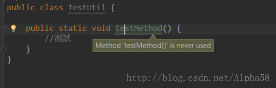

### Android Studio使用问题总结

#### 1. 方法未使用
> + Android studio 里面方法明明被调用了，却显示没有被调用。 显示如下”method ** is never used”，如图：  而且运行时也是正常的，但是找不到方法在哪里被调用很麻烦！

>

> + 解决  
网上找到答案是清理下缓存。果然解决了。  
点击File -> Invalidate Caches ，然后重启Android studio即可。

[Error:Jack is required to support java 8 language features. Either enable Jack](http://blog.csdn.net/u011781521/article/details/52702482)
