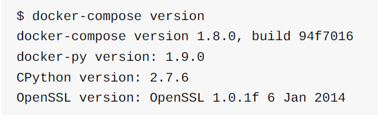
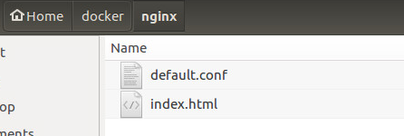
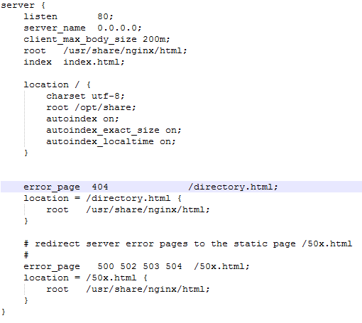
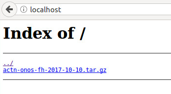

### 通过nginx搭建文件系统(通过docker搭建)
 + docker安装
 + docker-compose安装
 + 安装nginx镜像
 + nginx的基本配置
 + docker-compose的配置文件
 + 通过docker-compose启动nginx容器
 + 运行结果
 
##### docker安装
    略

##### docker-compose安装
> 1. 安装pip
```shell
sudo apt-get install python-pip
```
> 2. 安装docker-compose
```shell
sudo pip install -U docker-compose
```
> 3.查看版本信息
```shell
docker-compose version
```


##### 安装nginx的docker的镜像
```shell
sudo docker pull nginx
```

##### nginx的基本配置(用于覆盖docker中的对应文件)
>新建如下两个文件  

>   

> **default.conf** （可在configFile/nginx/default.conf中查看文本）  

> 

> **index.html**   （可在configFile/nginx/index.html中查看文本）  

##### docker-compose的配置文件(docker-compose.yml)
```
version: '2'
services:
  proxy:
    image: nginx
    restart: always
    logging:
      driver: "journald"
    ports:
      - "80:80"
    volumes:
      - /home/ubuntu/docker/nginx/default.conf:/etc/nginx/conf.d/default.conf
      - /home/ubuntu/share:/opt/share
      - /home/ubuntu/docker/nginx/index.html:/usr/share/nginx/html/index.html

```

##### 通过docker-compose启动nginx容器
```shell
sudo docker-compose up docker-compose.yml
```

##### 运行结果（在浏览器输入电脑ip可查看代理的文件目录）

