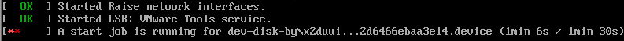
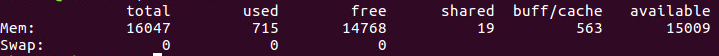

### ubuntu系统开机后需要等待90s问题解决
- 现象

> ubuntu开机的时候界面一直停留在开机界面，如下图    


  

> 通过 **alt+任意键** 可以看到如下界面 ,正常等待1min30s后可以开机



- 原因  

> 执行  **free -m** 可以看到



> 可以看到swap分区为0，也就是没有分配swap分区

- 解决方法

> 1. 增加 swap  
增加 2G swap 分区，只需要 修改 count=2k
```shell
sudo dd if=/dev/zero of=/swap.disk bs=1M count=2k
sudo mkswap -f /swap.disk
sudo swapon /swap.disk
```
2. 加入启动  
```shell
sudo vi /etc/rc.local
```
exit 0 之前加入：  
```shell
#sudo dd if=/dev/zero of=/swap.disk bs=1M count=2k && sudo mkswap -f /swap.disk && sudo swapon /swap.disk
sudo mkswap -f /swap.disk && sudo swapon /swap.disk
exit 0
```
>
