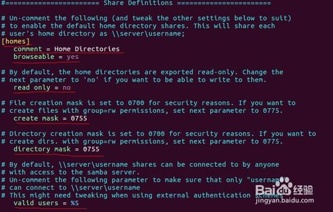

### ubuntu服务器中的文件共享到windows
+ **samba介绍**  
> Samba是在Linux和UNIX系统上实现SMB协议的一个免费软件，由服务器及客户端程序构成。SMB（Server Messages Block，信息服务块）是一种在局域网上共享文件和打印机的一种通信协议，它为局域网内的不同计算机之间提供文件及打印机等资源的共享服务。SMB协议是客户机/服务器型协议，客户机通过该协议可以访问服务器上的共享文件系统、打印机及其他资源。通过设置“NetBIOS over TCP/IP”使得Samba不但能与局域网络主机分享资源，还能与全世界的电脑分享资源。

+ **配置步骤**
  - 安装软件
    ```shell
    apt-get install samba
    ```

  - 修改配置
  > /etc/samba/smb.conf

  - 配置修改内容  

    

  - 服务重启
    ```shell
    service smbd restart && service nmbd restart
    ```

  - 把已有的账户添加到samba
    ```shell
    smbpasswd -a ubuntu (ubuntu为账户名)
    ```

+ **参考文章**  
  https://jingyan.baidu.com/album/db55b609e041584ba30a2f01.html?picindex=3
