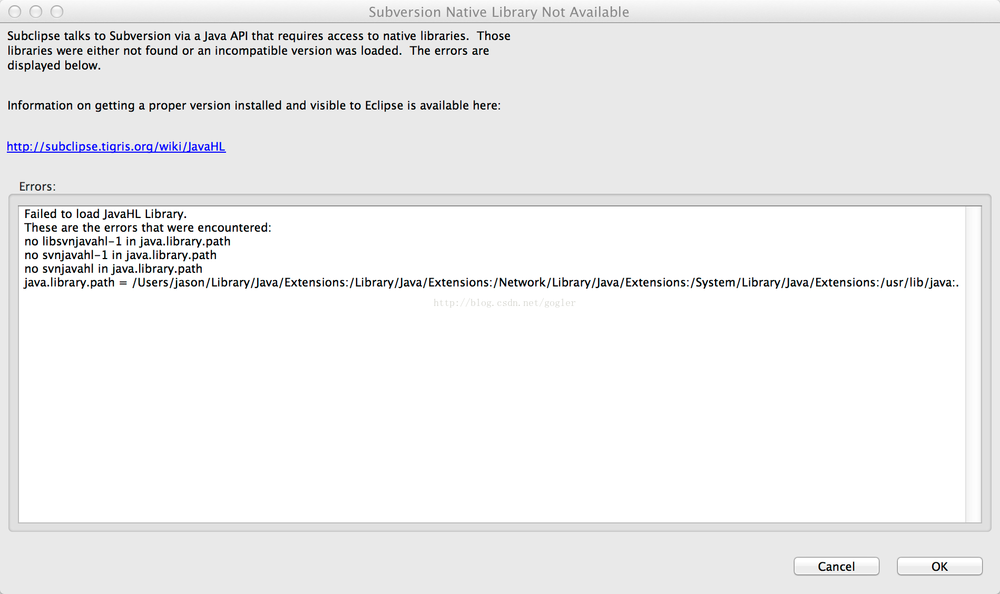

#### 出错信息：
在 windows7 中 Java 和 eclipse 都可以是64位的。如果需要配置 subclipse，中间可能会碰见 JavaHL 找不到库的问题。(图片来自网上)



> Failed to load JavaHL Library. These are the errors that were encountered: no libsvnjavahl-1 in Java.library.path no svnjavahl-1 in java.library.path no svnjavahl in java.library.path java.library.path = /usr/lib/jvm/java-6-sun-1.6.0.03/jre/lib/i386/client::/ usr/lib/jvm/java-6-sun-1.6.0.03/jre/lib/i386::/usr/lib/firefox:/usr/lib/ firefox/:/usr/java/packages/lib/i386:/lib:/usr/lib

#### 出错原因：
> 本机没有安装javaHL

#### 解决方法：
1. 下载和svn插件版本对应的silk-subversion
```
 http://www.sliksvn.com/pub
```
2. 安装后重启eclipse

#### 参考文章：
- http://www.binkery.com/archives/4.html
