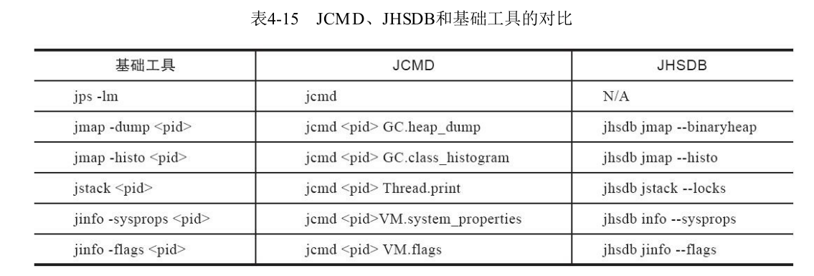

### jvm 命令参数

```shell
   1066  sudp jinfo PretenureSizeThreshold 19446
   1067  sudo jinfo PretenureSizeThreshold 19446
   1068  sudo jinfo -flag PretenureSizeThreshold 19446
   1077  sudo jinfo -flag NewRatio 19446
   1078  sudo jinfo -flag NewSize 19446
   1079  sudo jinfo -flag MaxNewSize 19446
   1080  sudo jinfo -flag OldSize 19446
   1081  sudo jinfo -flag MaxOldSize 19446
   1082  sudo jinfo -flag PermSize 19446
   1168  jinfo -gc 19446
   1169  sudo jinfo -gc 19446
   1198  sudo jinfo -flag CMSInitiatingOccupancyFraction 19446
   1199  sudo jinfo -flag CMSTriggerRatio 19446

sudo jcmd 31458 VM.native_memory baseline

sudo jcmd 31458 VM.native_memory summary.diff scale=MB

sudo jcmd 31458 GC.class_histogram

sudo jcmd 31458 GC.run

root@962519461d53:~# jcmd 860 GC.class_stats
860:
GC.class_stats command requires -XX:+UnlockDiagnosticVMOptions

--add-opens=java.base/jdk.internal.misc=ALL-UNNAMED
```

  1003  sudo jstat -gc 19446 2s

  989  sudo jmap -dump:file=/tmp/onos_19446_2.hprof 19446
  993  sudo jmap -histo 19446 | head -n 20




https://toutiao.io/posts/yaekab/preview

"sun.reflect.DelegatingClassLoader": http://blog.sina.com.cn/s/blog_56832f710101jw4j.html

https://www.cnblogs.com/williamjie/p/9558101.html

https://www.jianshu.com/p/b448c21d2e71

https://www.jianshu.com/p/61bf0e9011c4

https://blog.csdn.net/jiankunking/article/details/85626279

