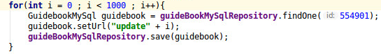

# MySql和mongoDB性能比

### 插入测试（测试机配置：内存16G，CPU 4核心）
+ 数据量：1000
    单位：ms | 第一次 | 第二次 | 第三次
    - | :-: | :-: | -:
    MySql | 8535 | 8455 | 8486
    MongoDB | 780 | 837 | 829

+ 数据量：10000
    单位：ms | 第一次 | 第二次 | 第三次
    - | :-: | :-: | -:
    MySql | 53138 | 84461 | 84483
    MongoDB | 3790 | 3392 | 2567

+ 数据量：10000
    单位：ms | 第一次 | 第二次 | 第三次
    - | :-: | :-: | -:
    MySql | 845806 | 837355 | 842049
    MongoDB | 19645 | 20023 | 20400

    **总结:**  随着数据量的增加，插入时间越来越长，整体效果是MongoDB插入速度明显快于MySql插入速度

### 批量插入测试
+ 数据量：10000 每次10
    单位：ms | 第一次 | 第二次 | 第三次
    - | :-: | :-: | -:
    MySql | 8791 | 8794 | 9161
    MongoDB | 3290 | 3250 | 3201

+ 数据量：10000 每次100
    单位：ms | 第一次 | 第二次 | 第三次
    - | :-: | :-: | -:
    MySql | 4944 | 4328 | 4311
    MongoDB | 3378 | 3338 | 3322

+ 数据量：10000 每次1000
    单位：ms | 第一次 | 第二次 | 第三次
    - | :-: | :-: | -:
    MySql | 4118 | 4101 | 4267
    MongoDB | 3518 | 3166 | 3272

+ 数据量：100000 每次100
    单位：ms | 第一次 | 第二次 | 第三次
    - | :-: | :-: | -:
    MySql | 30991 | 29662 | 30377
    MongoDB | 19879 | 19141 | 19212

+ 数据量：100000 每次1000
    单位：ms | 第一次 | 第二次 | 第三次
    - | :-: | :-: | -:
    MySql | 28970 | 29301 | 28929
    MongoDB | 19409 | 19095 | 19322
    **总结：** 通过批量插入可以看到，mongoDB的插入速度没有明显提升，但是MySql相对于单条插入速度提升明显，但是速度提升后仍然没有mongoDB插入数据的速度快。

### 数据更新测试
+ 数据量：1000
    单位：ms | 第一次 | 第二次 | 第三次
    - | :-: | :-: | -:
    MySql | 8778 | 8707 | 8835
    MongoDB | 1553 | 1679 | 1525

+ 数据量：10000
    单位：ms | 第一次 | 第二次 | 第三次
    - | :-: | :-: | -:
    MySql | 85224 | 85524 | 85196
    MongoDB | 7148 | 6841 | 6650

+ 数据量：100000
    单位：ms | 第一次 | 第二次 | 第三次
    - | :-: | :-: | -:
    MySql | 845779 | 844513 | 845621
    MongoDB | 41857 | 40878 | 40755

    **总结：** 通过更新测试，发现MongoDB的更新速度基本上是单条插入速度的两倍，MySql的更新速度基本和单条插入速度一致
    以下为更新操作的代码：根据代码可以认为更新操作是先查询后再插入的，所以速度不会低于插入操作

    
